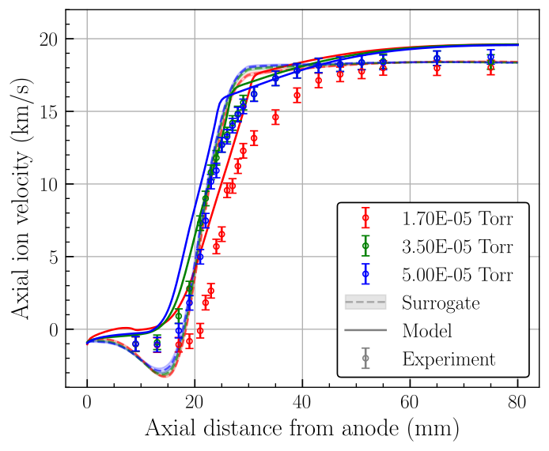

## Format a `matplotlib` figure

***Final result:***



***Steps:***

1. Install the [STIX fonts](https://www.stixfonts.org/).
1. Import the `uqtils.default` style template:

    ```python
    import matplotlib.pyplot as plt

    plt.style.use('uqtils.default')  # Globally in the file, or...

    with plt.style.context('uqtils.default'):
        plt.plot(...)
    ```

1. Use the `ax_default` convenience method for adding a legend and axis labels:

    ```python
    fig, ax = plt.subplots()
    h1, = ax.plot(x, y, '-r')
    ...
    leg = {'handles': [h1, ...], 'labels': [..., 'Model', 'Experiment']}

    uqtils.ax_default(ax, 'Axial distance from anode (mm)', 'Axial ion velocity (km/s)',
                      legend=leg)
    ```

1. Optionally adjust other plot settings:

    ```python
    with matplotlib.rc_context({'font.size': 14}):
        plt.plot(...)
    ```
